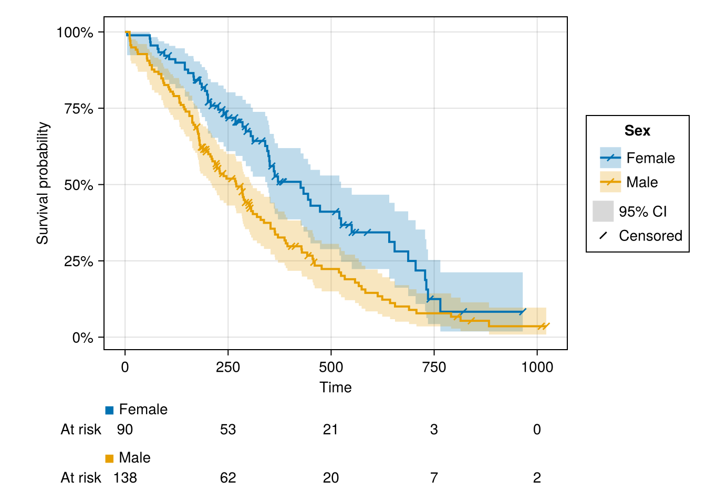
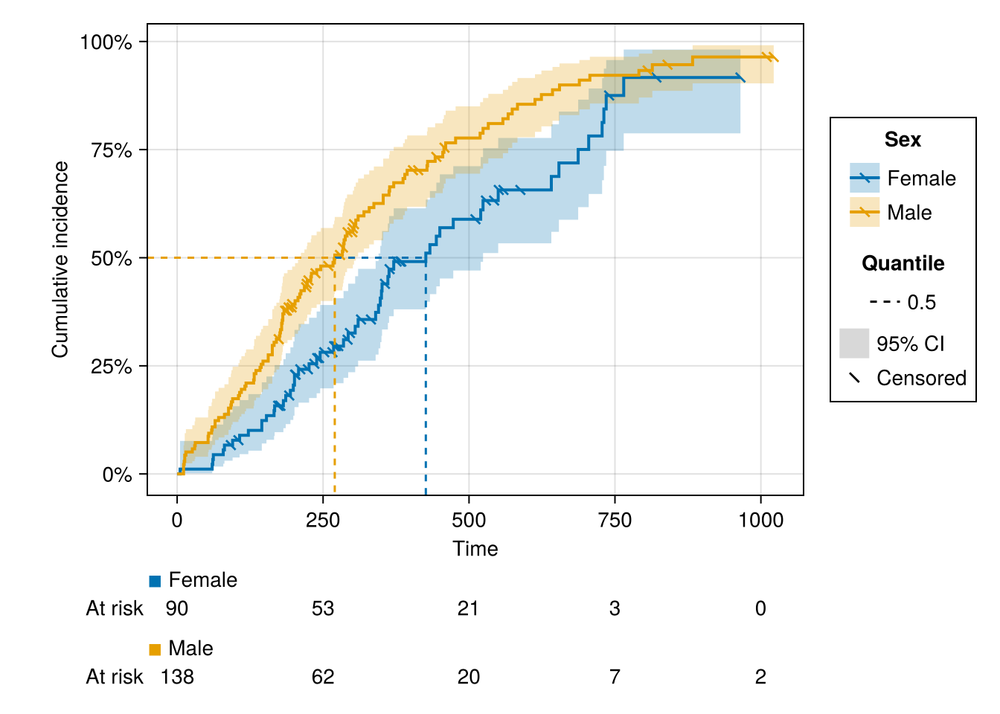

# SurvivalMakie


[](https://github.com/PumasAI/SurvivalMakie.jl/actions/workflows/CI.yml)
[](https://pumasai.github.io/SurvivalMakie.jl/dev/)

SurvivalMakie plots survival analysis results. A single `survivalplot`
function turns a table of event times into a Kaplan-Meier (or
cumulative-incidence) figure with confidence bands, censoring marks, a
number-at-risk table, and optional quantile lines. The estimate comes
from [SurvivalModels.jl](https://github.com/JuliaSurv/SurvivalModels.jl)
and the drawing from [AlgebraOfGraphics](https://aog.makie.org), so
grouping, legends, scales, and faceting are handled by a mature plotting
stack.

## Example

``` julia
using SurvivalMakie, CairoMakie, RDatasets, DataFrames

lung = dataset("survival", "lung")
transform!(lung,
    :Status => ByRow(==(2)) => :Died,
    :Sex => ByRow(s -> s == 1 ? "Male" : "Female") => :Sex,
)

survivalplot(lung; time = :Time, status = :Died, color = :Sex)
```



Faceting, cumulative incidence, quantile lines, and styling are shown in
the [documentation](https://pumasai.github.io/SurvivalMakie.jl/dev/).

``` julia
survivalplot(lung; time = :Time, status = :Died, color = :Sex,
    statistic = :cumulative_incidence, quantile = 0.5)
```


